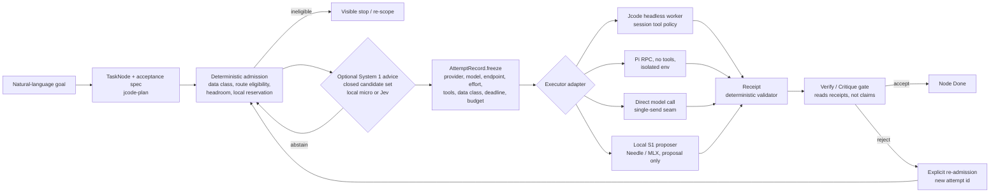

# Harness loop architecture: outer/inner loops, System 1/System 2, model ladder

Status: architecture plan, 2026-09-18. Supersedes nothing; extends
`SWARM_TASK_GRAPH.md` (the DAG engine) and consumes the Fable 5.1 audit at
`~/.jcode/scratch/architecture-fable-handoff-20260918T1939Z/FABLE-AUDIT.md`.
Everything marked **[verified]** was checked against source HEAD `5d7c4a97a`.
Everything else is a proposal.

## 1. The five independent axes

Most confusion in prior planning came from collapsing these. They are separate
columns on every task node, never synonyms.

| Axis | Values | Who sets it |
|---|---|---|
| Loop | outer (Jcode owns lifecycle, admission, verification, operator view) / inner (an executor runs one bounded attempt) | Fixed: Jcode is the only outer loop |
| Judgment style | System 1 (typed choice/score/extract over a closed candidate set, no free generation) / System 2 (generative reasoning, code, prose) | Task class |
| Capability tier | deterministic code / local micro (Needle-class, <100 MB) / local small (MLX 2B to 9B) / local mid (MLX 27B, burst only) / remote open-weight (DeepSeek, GLM) / included frontier (Terra, Sol, Fable, Opus) | Admission, per task class, from the route table |
| Location | local process / loopback service / remote provider | Follows data class, fail-closed |
| Authority | none (advise) / propose (closed set) / execute (inside a frozen envelope) | Deterministic code only. A larger model never gains authority for being smarter |

Consequence: "Needle is a System 2 model" and "Jev is the inner loop" are both
category errors. Needle and Jev are System 1 proposers that can sit in either
loop. Pi and Jcode headless workers are inner-loop System 2 executors. The 9B
MLX model is a local System 2 tier, not a micro-model.

## 2. Layer map: what exists in the fork today

| Layer | Status | Where |
|---|---|---|
| Durable task DAG, deep/light modes, gates, typed handoff, artifact dataflow on edges | **[verified] exists** | `crates/jcode-plan/src/dag/{mod,ops,bridge}.rs` |
| Swarm lifecycle, spawn with model/effort/label, ownership tree, completion reports | **[verified] exists** | `jcode-protocol/src/wire.rs` `CommSpawn`, `jcode-app-core/src/server/headless.rs` |
| Per-session tool allow/deny policy | **[verified] mechanism exists, not plumbed from spawn** | `Agent::build_base` takes `allowed_tools`; `new_with_initial_ownership` reads global config (`agent.rs:418`) |
| Deterministic bash destructive gate | **[verified] exists** | `tool/bash_destructive_gate.rs`, `jcode-command-risk` |
| Frozen-body single-send transport | **[verified] exists, zero product callers** | `jcode-provider-openrouter-runtime/src/openrouter_provider_impl.rs` |
| Fail-closed credential fallback | **[verified] exists** | `jcode-provider-env` |
| Local OpenAI-compatible lane (mlx-serve on loopback) | **[verified] configured** | `~/.jcode/config.toml` `[providers.mlx-serve]`: Ornith 9B 4-bit, gemma-4-e2b 4-bit, Qwen3.8-27B 3.8bpw |
| Attempt record, attempt id, frozen envelope | **absent** | proposed `crates/jcode-attempt-types` (this change) |
| Data class / provenance | **absent** | same crate |
| Receipt schema + deterministic validator | **absent** | same crate |
| Receipt-bound Verify gate | **absent** (gate reads prose; `validate_artifact` is thinness-only) | `jcode-plan/src/dag/ops.rs` |
| Spawn envelope (tools, deadline, budget, data class) | **absent** | `CommSpawn` + headless constructor |
| Local spend reservation / settlement | **absent** | none |
| Executor adapters (Pi RPC, direct model call, local S1) | **absent** | none |
| Route table as data | **absent** (only prose in `~/.jcode/swarm-prompt.md`) | none |

The architecture the operator wants is mostly a typing and gating problem on
top of machinery that already exists. No new scheduler, router service, daemon
or UI is proposed.

## 3. Target topology

Authority lives in three deterministic places: admission (before), the frozen
record (during), the receipt validator plus gate (after). Models never touch
these. Every executor satisfies the same
`execute(FrozenAttempt, Packet) -> RawResult` contract and the same receipt
validator, so the DAG engine does not care whether a node ran on Pi, a headless
Jcode worker, a 9B MLX model or Sol.

## 4. Model ladder on this machine (M3 Pro, 36 GB unified)

Unified memory must hold model weights, KV cache, an Astro build, Playwright
Chrome and the Jcode TUI at the same time. Budget accordingly.

| Tier | Candidate | Resident cost | Admitted for | Not for |
|---|---|---|---|---|
| T0 deterministic | parsers, `design.md lint`, `impeccable detect`, slop regex, `astro check`, Zod/JSON Schema, compilers | 0 | Everything it can decide. Always first | - |
| T1 local micro S1 | Needle 3 (proposal-only `complete()`), embeddings | tens of MB | Closed-set extraction, tool-schema proposal, semantic retrieval over 5 to 10 candidates | Permissions, counting, dates, anything already structured |
| T2 remote S1 | Jev (native TypeSafe, retries off) | 0 local, $0.042/M in | Choice/Score judgments on public/synthetic state: "does quoted evidence support claim", theme id from catalog, slop vs ok | Private working-tree content until D3 is resolved |
| T3 local small S2 | gemma-4-e2b 4-bit (~2 GB), Ornith 9B 4-bit (~6 GB) | keep one resident | Strict-JSON slot filling, copy drafts, page-graph composition, small single-file fixes | Art direction, multi-file refactors |
| T4 local mid S2 | Qwen3.8-27B 3.8bpw (~13 GB) | burst only, unload before Playwright | DESIGN.md prose, Pi fixer with tools once D1 is chosen | Anything concurrent with a browser plus build |
| T5 remote open-weight S2 | DeepSeek V4 Flash 0731 pinned, GLM candidate | metered, needs D2 | Public/synthetic generation, bounded reasoning, fixer escalation | Private data, unbounded spend |
| T6 included frontier S2 | Terra (worker), Sol (lead), Fable (architecture brief), Opus 5 (bounded review) | subscription quota, keep 20% headroom | Architecture, ambiguous debugging, security review, failed art direction, final integration review | Mechanical documentation, bulk extraction |

Rules: skip straight to the admitted tier for the task class, do not climb the
ladder after three cheap failures. Local inference is not free: wall time, RSS
and interactive-latency impact enter the cost model. One writer, at most two
independent readers. The Verify gate cost is part of every route's cost.

Selection is the cheapest route on the per-task-class Pareto frontier that
passes data class, risk class and headroom, using

$$C_{acc} = \frac{c_{attempt} + c_{verify} + c_{review}}{p_{accept}} + (1-p_{accept})\,c_{escalate}$$

with $p_{accept}$ from a per-task-class holdout, never a vendor benchmark.

## 5. Website-factory DAG mapped onto Jcode primitives

The reference plan (`~/Downloads/Using a Directed Acyclic Graph (DAG) is an
excelle.md`) is correct on the product shape: a locked atelier starter,
`PRODUCT.md` and `DESIGN.md` as contracts, a closed section registry, a compiler
that stamps files, detectors as gates, and cycles only inside verify with a cap
of 3. Three corrections before adopting it:

1. **No LangGraph, Temporal or Worker orchestrator.** `jcode-plan` is the DAG
   owner; the factory graph is a `task_graph` with `depends_on` edges. A second
   orchestrator would be a second route owner and violates the non-negotiables.
2. **Needle is not a System 2 model.** Node 1 (`PRODUCT.md`) is T3 local small
   S2 with strict JSON, or T6 when the brief is ambiguous. Needle serves nodes
   0 and 2 as a closed-set proposer only.
3. **The "implement first" list belongs to the factory repository**, not to
   Jcode: vendored detectors, 8 to 12 original atelier `DESIGN.md` themes, the
   section registry with its JSON schema, and the gate chain
   `designmd lint -> impeccable detect -> slop regex -> astro check -> Playwright`.
   Jcode supplies the DAG, admission, envelopes, receipts and gates. The
   `~/workspace/projects/website-development-business` repository already has
   packets, receipts, `contracts:check` and a D0 to D9 graph; F1 to F4 of its
   `docs/72-*` plan (packets as JSON, change-aware gates, durable receipts,
   batched mechanical work) are the factory-side twin of this document.

Node routing, expressed in the five axes:

| Factory node | Judgment | Tier | Executor | Receipt | Gate |
|---|---|---|---|---|---|
| 0 classify brief | S1 | T1/T2 | local S1 proposer | model-call receipt, candidate set hash | deterministic schema check |
| 1 `PRODUCT.md` | S2 | T3, escalate T6 | headless Jcode worker, read-only | command receipt for schema validate | Critique gate reads receipt |
| 2 theme pick + dials | S1 | T1/T2 | local S1 proposer over 8 to 12 theme ids | candidate set hash | deterministic: id must exist |
| 3 `DESIGN.md` | S2 | T4, escalate T5/T6 after two lint failures | headless worker | `design.md lint` exit 0 receipt | Verify gate requires the lint receipt |
| 4 token export | T0 | - | command | `design.md export` receipt | exit code |
| 5 IA + Sveltia schema | S2 strict JSON | T3 | headless worker | Zod validate receipt | Verify |
| 6 page graphs | S2 strict JSON, parallel | T3 | light-mode fan-out | schema validate per page | Verify |
| 7 copy | S2 + T0 slop gate | T3 | headless worker | slop regex receipt, score | Verify; rewrite only below threshold |
| 8 materialize | T0 | - | compiler command | receipt | exit code |
| 9 detect | T0 | - | `impeccable detect`, Hallmark gates | findings JSON receipt | exit code |
| 10 fix (cycle, cap 3) | S2 | T4, escalate T5/T6 | Pi no-tools until D1, then Pi with tools | one-file patch plus `astro check` receipt | Verify |
| 11 visual | T0 | - | Playwright | screenshot hashes | exit code |
| 12 deploy | external effect | - | Wrangler | gated per turn | operator approval |

Nodes 4, 8, 9, 11 have no model. Nodes 0 and 2 are where System 1 earns its
keep first because the candidate sets are small, closed and public.

## 6. Gaps ranked by blast radius, and the phase that closes each

| Gap | Blocks | Phase |
|---|---|---|
| No `AttemptRecord`, `Receipt`, `DataClass` types | every requirement | **P1 (this change, Packet A)** |
| Verify gate accepts prose `validation` | R7 evidence-grounded acceptance | P1b: `validate_gate_pass` requires a receipt in deep mode |
| Spawn has no tool allowlist / deadline / budget / data class | R2, R6 on the swarm path | P1c: add optional `envelope: Option<SpawnEnvelope>` to `CommSpawn`, plumb through headless constructor to `build_base(allowed_tools)` |
| Single-send seam unreachable | R2 frozen route on direct calls | P3: trusted caller behind a feature flag; negative test that `MultiProvider` failover cannot re-issue an attempt |
| No local reservation | R4 | P3: ledger with ambiguous-settlement retention; account cap is D2 |
| No executor adapters | inner loops | P2: local S1 proposer subprocess (telemetry off, egress capture); P4: Pi RPC no-tools adapter waiting on `agent_settled` |
| No route table as data | R9 reversible promotion | P2: `~/.jcode/routes.toml` `task_class -> {route, promoted_at, evidence_path}`, read-only to workers |
| Deterministic CI-scout baseline missing | measured extraction gap that decides whether Needle is worth it | P1 Packet B (`crates/jcode-ci-scout`) |

Dependencies: P1 first; P2 and P3 independent after P1; P4 needs P3; P5 (one
metered open-weight worker) needs P2, P3 and D2; the factory DAG can run on
P1 plus existing headless workers for nodes 1, 3, 5, 6, 7 immediately, with
T0 nodes as plain commands and no S1 tier until P2 reports lift.

## 7. Operator decisions (unchanged from the audit, one added)

- **D1** containment for any tool-enabled Pi: Gondolin micro-VM, Docker,
  `sandbox-exec`, or no tool-enabled Pi. Until chosen, Pi is no-tools and
  public/synthetic only.
- **D2** spend guarantee: account-side hard cap on the OpenRouter key, or accept
  local reservation only and keep P5 blocked.
- **D3** Jev data policy: public/synthetic only indefinitely, or enterprise ZDR
  before any private-context judgment.
- **D4** first vertical slice: CI-scout (generic) or factory nodes 0 and 2
  (theme/brief classification, public catalog). Both are closed-set public S1
  tasks; the factory one has a real customer.
- **D5** Needle trial: install, engine download, hash pinning, license review,
  only after P1 reports a nonzero extraction gap or D4 selects node 0/2.
- **D6** standing envelope for routine work: read-only exploration, offline
  `cargo test -p <crate>`, scoped formatting, commits on the working branch.
- **D7 (new)** local S2 residency: keep Ornith 9B resident by default and treat
  Qwen 27B as burst-only, or the reverse. This sets which tier is "always on".

## 8. Rejected alternatives

- General or learned router (RouteLLM, OpenRouter Pareto): no labels, no
  holdout, cannot enforce banned families, second route owner.
- Pi as scheduler or with sub-agents: no sandbox, duplicates Jcode lifecycle.
- Second credential broker: `provider-env` plus the single-send seam already
  form the boundary.
- Jev on every tool call: unmeasured cost per boundary, jagged on adversarial
  CI text.
- Fine-tuning Needle before base lift is measured.
- LangGraph/Temporal/Worker orchestrator for the factory: second DAG owner.
- Thin UI or daemon: add fields to completion reports and the gallery card
  (`attempt_id, route, data_class, reserved, spent, receipt_ok, next_action`).
