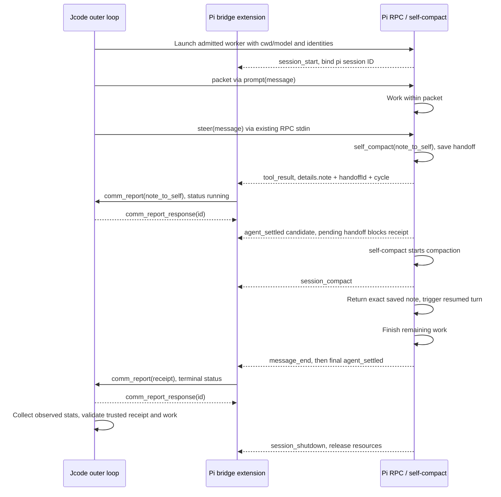

# Jcode / pi worker interoperability

Status: Phase 9a design note, 2026-09-21. This defines payload conventions, not implemented bridge support. No code, new transport, or harness API version change is included.

## Boundaries and evidence

Jcode owns admission, the worker identity, cancellation, verification, and the trusted receipt. Pi owns the inner model/tool loop and self-compaction. The four names below are logical messages, not four new wire discriminants.

There are three distinct existing boundaries:

- Public harness NDJSON: `ClientFrame { v, id, request }`, flattened `req`, and `ServerFrame { v, reply_to?, event }`, flattened `ev`. The current version is major 1, minor 6. See `crates/jcode-harness-api/src/lib.rs:49-76`, `crates/jcode-harness-api/src/requests.rs:5-15`, and `crates/jcode-harness-api/src/events.rs:5-23`. A connection starts with `Hello`. Unknown fields/event kinds are forward-compatible, not a way to implement unsupported commands (`crates/jcode-harness-api/src/lib.rs:7-14`).
- Internal daemon NDJSON: `jcode_protocol::Request`, tagged `type`, with integer request IDs (`crates/jcode-protocol/src/wire.rs:40-48`). This carries `comm_spawn`, `comm_message`, and `comm_report`. A bare `{"type":"report"}` is **not** that protocol.
- Pi RPC stdin/stdout: JSONL `type` commands and events. The executor currently writes one `{"type":"prompt","message":...}` and later requests stats (`crates/jcode-executor-pi/src/lib.rs:169-182`, `crates/jcode-executor-pi/src/lib.rs:237-245`). It starts `--mode rpc --no-session --no-tools`, not a tool-enabled persistent worker (`crates/jcode-executor-pi/src/lib.rs:101-107`).

External citations use absolute local paths because the installed extensions and copied pi v0.85.1 documentation are not vendored here. They describe the inspected snapshot, not a promise that all pi versions have these hooks.

## Logical message fields and existing mappings

Types below use JSON vocabulary, with `u64` meaning a nonnegative integer. Required means required by this proposed bridge convention, which can be stricter than the existing wire schema. Structured payloads can be JSON-encoded inside existing string fields. They are not new top-level fields on those frames.

### 1. `packet`: jcode to pi, once at admitted worker start

| Field | Type | Required | Meaning |
|---|---|---|---|
| kind | string literal `packet` | yes | Logical payload discriminator |
| session_id | string | yes | Jcode worker session, assigned by outer loop |
| attempt_id | string | yes | Admitted attempt correlation |
| message | string | yes | Full goal packet including scope, checks, and stop conditions |
| working_dir | string | yes | Authorized worker directory |
| model | string | no | Already-admitted model selection |
| effort | string | no | Requested effort, not authority to widen scope |

Existing outer carrier: `Request::CommSpawn`, `id: u64`, `session_id: String` (the **coordinator**, not the new child), plus optional `initial_message`, `working_dir`, `model`, `effort`, `spawn_mode`, and other admission fields (`crates/jcode-protocol/src/wire.rs:553-600`). Store the goal packet in `initial_message`. Do not confuse that caller identity with the assigned worker identity in the eventual payload.

Existing inner carrier: pi `prompt`, required `type: "prompt"` and `message: string`, optional correlation `id: string` (`/Users/ianalitis/.jcode/scratch/selfcompact/repo/ai_docs/pi-rpc.md:24-51`). Serialize the logical packet into `message`, or render its task text while preserving identity in launcher configuration. `working_dir` is launch configuration, not a pi prompt-frame option. The current executor accepts a `FrozenAttempt`, a prompt string, and a deadline (`crates/jcode-executor-pi/src/lib.rs:129-137`).

The public API can create/attach a session and send text using `ApiRequest::SendMessage { session_id, content, ... }` (`crates/jcode-harness-api/src/requests.rs:40-68`), but this does not itself spawn pi. `CommSpawn.spawn_mode` is already an optional string, not proof that its dispatcher supports `pi`. Phase 9c must supply that mapping and child registration.

### 2. `note_to_self`: pi to jcode, after the note is saved

| Field | Type | Required | Meaning |
|---|---|---|---|
| kind | string literal `note_to_self` | yes | Logical payload discriminator |
| session_id | string | yes | Jcode worker identity |
| attempt_id | string | yes | Admitted attempt correlation |
| pi_session_id | string | yes | Pi runtime identity, distinct from jcode identity |
| handoff_id | string | yes | `details.handoffId`, stable across retries |
| cycle | integer | yes | `details.cycle`, anticipated compaction cycle |
| note_to_self | string | yes | `details.note`, exact saved text, never trimmed |
| tool_call_id | string | no | Hook's `toolCallId` for diagnostics |

Fire on successful `tool_result` where `event.toolName === "self_compact"` and `event.isError === false`. Validate `details.note`, `details.handoffId`, and `details.cycle` before forwarding. The tool persists the note before returning those details (`/Users/ianalitis/.pi/agent/extensions/self-compact/self-compact.ts:526-552`). Read the **saved** `details.note`, not merely `event.input.note_to_self`: a retry keeps the original bytes. This notification means saved, not compaction succeeded.

Existing carrier: `Request::CommReport`, `type: "comm_report"`, `id: u64`, `session_id: string`, `message: string`, optional `status`, `validation`, `follow_up`, `tldr` (`crates/jcode-protocol/src/wire.rs:642-663`). Put the logical JSON in `message` and explicitly send `status: "running"`, never the default `ready` for an intermediate checkpoint. Receiver deduplicates by `(session_id, attempt_id, handoff_id)`. Deduplication is a bridge requirement, not existing `CommReport` behavior established by this note.

There is **no named `self_compact` extension event emitted here**. It is a registered tool. The generic `tool_result` hook is sufficient and exposes `toolName`, `toolCallId`, `input`, `details`, and `isError` (`/Users/ianalitis/.jcode/scratch/selfcompact/repo/ai_docs/pi-extensions.md:844-865`). Thus the no-hook stop condition does not apply. Do not subscribe to an invented `pi.on("self_compact")` or assume a `pi.events` emission exists. The custom event bus only delivers what another extension explicitly emits (`/Users/ianalitis/.jcode/scratch/selfcompact/repo/ai_docs/pi-extensions.md:1731-1738`).

### 3. `receipt`: pi to jcode, at final worker completion

| Field | Type | Required | Meaning |
|---|---|---|---|
| kind | string literal `receipt` | yes | Logical payload discriminator |
| session_id | string | yes | Jcode worker identity |
| attempt_id | string | yes | Admitted attempt correlation |
| pi_session_id | string | yes | Pi runtime identity |
| status | string, `completed` or `failed` | yes | Worker-reported outcome |
| message | string | yes | Final worker summary |
| validation | string | no | Worker claims about checks, not verified evidence |
| follow_up | string | no | Blockers and next actions |
| commit_hash | string | no | Claimed protected work, independently checked by jcode |

Existing carrier: the same `Request::CommReport`, now with explicit terminal `status`, summary/structured payload in `message`, and optional `validation` and `follow_up` (`crates/jcode-protocol/src/wire.rs:642-663`). Its acknowledgement is `ServerEvent::CommReportResponse { id, status, message }` (`crates/jcode-protocol/src/wire_events.rs:635-641`). An acknowledgement proves recording, not correctness of worker claims.

Use `agent_settled`, not `agent_end`, as the completion candidate. Pi documents that retries and queued continuations can follow `agent_end` (`/Users/ianalitis/.jcode/scratch/selfcompact/repo/ai_docs/pi-extensions.md:569-583`). **Do not report completion while a handoff is pending, compacting, failed awaiting recovery, or awaiting its resumed turn.** Self-compact itself starts compaction inside `agent_settled` (`/Users/ianalitis/.pi/agent/extensions/self-compact/self-compact.ts:836-844`). An idle check alone is not a sufficient terminal-work predicate. See the open question below about handler ordering and final settlement.

Current executor parsing accumulates assistant text, observes `agent_end`, and marks `agent_settled` as terminal (`crates/jcode-executor-pi/src/protocol.rs:44-77`). It handles prompt rejection, retry failure, extension errors, and stats responses, but ignores other kinds (`crates/jcode-executor-pi/src/protocol.rs:78-120`). The adapter breaks at settlement (`crates/jcode-executor-pi/src/lib.rs:225-232`) and creates a **trusted** `jcode_attempt_types::Receipt` from observed text hashes, exit outcome, usage, and timestamps, then validates it (`crates/jcode-executor-pi/src/lib.rs:287-325`). The logical worker `receipt` is not that trusted receipt and must never replace it. Host cancellation, timeout, or process death can require a harness-generated failure receipt without an extension completion event.

### 4. `steer`: jcode to pi, during an active attempt

| Field | Type | Required | Meaning |
|---|---|---|---|
| kind | string literal `steer` | yes | Logical payload discriminator |
| session_id | string | yes | Target jcode worker identity |
| attempt_id | string | yes | Reject instructions for stale attempts |
| message | string | yes | Instruction text within admitted scope |
| request_id | string | no | Pi command correlation |

Existing outer carrier: `Request::CommMessage { id: u64, from_session: string, message: string, to_session?: string, channel?: string, delivery?: CommDeliveryMode, wake?: bool, tldr?: string }` (`crates/jcode-protocol/src/wire.rs:448-466`). Require `to_session` for this bridge to avoid broadcasts. Existing public equivalent for jcode sessions is `ApiRequest::SoftInterrupt { session_id, content, images?, urgent? }`, not a pi dispatcher (`crates/jcode-harness-api/src/requests.rs:73-82`).

Existing inner carrier: pi RPC `{"type":"steer","message":"..."}` with optional command `id`, acknowledged by `response { command: "steer", success }`. Delivery is after current assistant tool calls and before the next model call, not an immediate cancellation (`/Users/ianalitis/.jcode/scratch/selfcompact/repo/ai_docs/pi-rpc.md:80-100`). If the bridge extension receives a routed instruction, use `pi.sendUserMessage(message, { deliverAs: "steer" })`; this injects a user message and, if idle, starts a turn (`/Users/ianalitis/.jcode/scratch/selfcompact/repo/ai_docs/pi-extensions.md:1441-1470`). Do not inject stale steering after the attempt closes.

The internal `ServerEvent::Notification` already carries sender, notification type, and text (`crates/jcode-protocol/src/wire_events.rs:579-591`), but it does not establish a pi worker subscription or attempt correlation. Current executor stdin has no mid-run input channel. Prefer routing to its existing pi stdin over inventing a socket command. Phase 9b/9c must settle delivery ownership, not assume that connecting a report socket subscribes to instructions.

## Extension events required by the bridge

| Event | Use | Guard / payload |
|---|---|---|
| `session_start` | Bind socket and identities | RPC mode allowed, require launcher-assigned jcode identity, obtain pi ID via session manager |
| `tool_result` | Forward saved note | `toolName === "self_compact"`, successful result, validated `details.note`, `handoffId`, `cycle` |
| `session_compact` | Mark successful checkpoint | `compactionEntry`, `reason`, `fromExtension`, `willRetry`, do not infer original note from summary |
| `session_compact_failed` | Retain pending checkpoint / report blocker | `errorMessage`, `aborted`, `reason`, do not emit successful completion |
| `message_end` | Capture final assistant text and observe resumed handoff | Filter roles, do not treat every message as terminal |
| `agent_settled` | Consider terminal report | Require no pending handoff/continuation and current idle state, ordering must be tested |
| `session_shutdown` | Close resources and bounded flush | Not proof of successful work |

Hook evidence: compaction and failure payloads at `/Users/ianalitis/.jcode/scratch/selfcompact/repo/ai_docs/pi-extensions.md:455-492`, message roles at `/Users/ianalitis/.jcode/scratch/selfcompact/repo/ai_docs/pi-extensions.md:619-628`, and shutdown at `/Users/ianalitis/.jcode/scratch/selfcompact/repo/ai_docs/pi-extensions.md:518-526`. The existing socket extension demonstrates `session_start` and `agent_settled`, but explicitly excludes RPC with a TUI-only gate (`/Users/ianalitis/.pi/agent/extensions/herdr-agent-state.ts:225-257`). Copy its connection pattern, not that gate. Rebind on session replacement and release old subscriptions, as the SDK runtime example does (`/Users/ianalitis/.jcode/scratch/selfcompact/repo/ai_docs/example-sdk-13-session-runtime.md:43-72`).

`session_compact` does not expose the saved note as a first-class field. Compaction entries hold summaries and optional implementation-specific details, while extension custom entries are separate state, not model context (`/Users/ianalitis/.jcode/scratch/selfcompact/repo/ai_docs/pi-session-format.md:231-287`). Self-compact returns its saved note through a custom message with `triggerTurn: true` (`/Users/ianalitis/.pi/agent/extensions/self-compact/self-compact.ts:355-370`). Do not compact or paraphrase it again in the bridge.

## Socket and environment contract

1. `$JCODE_SOCKET` names the **existing internal daemon Unix socket**, not the public harness socket. `$JCODE_API_SOCKET` selects the latter (`crates/jcode-harness-api/src/sockets.rs:66-81`). For 9b, write internal `comm_report` JSON plus LF to `$JCODE_SOCKET`. Do not add `v`/`req` envelopes or send herdr's `method`/`params` objects there. Public clients continue using the unchanged versioned API and handshake.
2. Proposed launcher environment: `JCODE_SESSION_ID: string` is the registered **jcode worker** ID, `JCODE_ATTEMPT_ID: string` is its admitted attempt. These are bridge configuration requirements, not variables currently set by `run_pi_attempt`. Its explicit environment currently only sets telemetry/version-check controls (`crates/jcode-executor-pi/src/lib.rs:145-157`). Require both identities when enabling the bridge. Missing socket means inert standalone pi. A socket with missing identity means fail closed with a stderr diagnostic, not reporting as the coordinator.
3. Obtain `pi_session_id` from `ctx.sessionManager.getSessionId()`. Never substitute it for `CommReport.session_id`. Herdr's code separately retrieves the session file and session ID (`/Users/ianalitis/.pi/agent/extensions/herdr-agent-state.ts:73-88`). `--no-session` disables disk persistence, so do not require a session-file path or promise crash recovery from one.
4. Use `net.createConnection`, bounded connection/write/read time, NDJSON framing, and close resources. Herdr demonstrates newline writes, timeouts, and a bounded retry (`/Users/ianalitis/.pi/agent/extensions/herdr-agent-state.ts:21-54`). Unlike herdr's any-data success rule, parse a complete `comm_report_response`, match `id`, and handle error replies. Retrying without acknowledgement is ambiguous: retain the same logical handoff identity and deduplicate at the receiver. Do not silently declare delivery on timeout.
5. Socket access is local authority. Use only the launcher-supplied endpoint and registered identity. No socket discovery fallback, no note content in stdout diagnostics, no external forwarding. Pi stdout remains its RPC stream. A reporting connection alone is not an inbound steer subscription.

## One intended lifecycle

This sequence is the target contract, not a claim that the present no-tools executor runs it. Dashed arrows are existing event/report shapes, not new transports.

## Gap inventory

These are absent typed representations or adapter inputs, not a request to add them in 9a. Existing opaque string carriers are sufficient for an initial bridge. Each row names the enum or adapter it would join, then proposed field names and types only. No public API addition or version bump is authorized.

| Gap | Prospective owner | Proposed fields |
|---|---|---|
| MISSING typed worker packet | `jcode_harness_api::ApiRequest` | `session_id: String`, `attempt_id: String`, `message: String`, `working_dir: String` |
| MISSING typed saved-note event | `jcode_harness_api::ApiEvent` | `session_id: String`, `attempt_id: String`, `pi_session_id: String`, `handoff_id: String`, `cycle: u64`, `note_to_self: String` |
| MISSING typed worker-report event | `jcode_harness_api::ApiEvent` | `session_id: String`, `attempt_id: String`, `status: String`, `message: String`, `validation: Option<String>`, `follow_up: Option<String>` |
| MISSING attempt-correlated steering | `jcode_protocol::Request::CommMessage` | `attempt_id: Option<String>` |
| MISSING explicit pi identity binding | `jcode_executor_pi::PiConfig` (struct, not enum) | `jcode_session_id: String`, `attempt_id: String`, `jcode_socket: PathBuf` |

## Open questions and 9b acceptance

- Can 9b use the existing `tool_result` details without touching self-compact? Evidence says yes. If an installed pi version lacks that generic hook, stop rather than inventing an event. Smallest alternative for approval: a single explicit custom event emission immediately after `save()` with the same note/handoff fields, using the existing `pi.events` bus.
- How will final settlement be distinguished from self-compact's idle checkpoint? Require a scripted run with a compaction in the middle and exactly one terminal report after the resumed turn. Test extension load order and the executor's current first-settlement exit. This is unresolved integration behavior, not established by the generic RPC documentation.
- Who registers the pi worker's jcode session and injects its session/attempt IDs? Phase 9c should own this. Never impersonate the parent session to make reporting appear functional.
- Will steering be routed by the executor to pi stdin, or by a daemon-attached extension connection? Prefer existing stdin. The herdr one-shot reporting pattern does not implement inbound subscription. Do not add a transport just to satisfy the word `steer`.
- The current executor disables tools and persistence. A real self-compaction lifecycle needs the separately authorized tool/containment work. A docs-only mapping does not enable tools or weaken D1.
- For 9b, capture one acknowledged saved-note report with exact text and a stable handoff ID, exercise retry deduplication and compaction failure, then capture one final worker report. Independently verify the outer-loop receipt. A bridge report alone never satisfies the work gate.

## Citation validation

All `file:line-range` references in this note must be checked using `sed -n '<start>,<end>p' <file>` against the inspected snapshot. Validation output accompanies the packet completion, including at least six excerpts, the gap-marker count, and a zero count for the forbidden punctuation character. This is a documentation-only change, so no build, reload, or runtime behavior claim is made.
