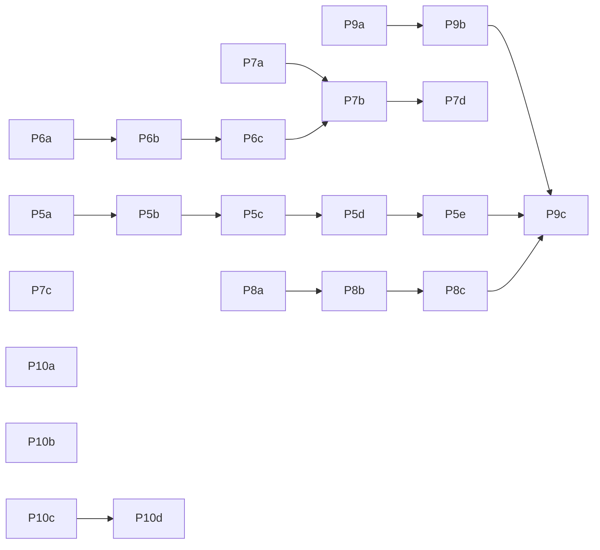

# Ephemeral workforce plan: self-compaction, classified kickoff, lane routing, jcode/pi interop

Date 2026-09-21. Author: fresh-session captain. Supersedes nothing; it sequences
the open threads (Phase 4 routing contract, ledger remainder, upstream sync)
under one objective and adds the self-compaction work from
`docs/references/2026-09-21-self-compact-pi-agent.md`.

Standard: `docs/HARNESS_LOOP_ARCHITECTURE.md` owns the axes, ladder, and
admission → freeze → receipt → gate sequence. This plan names that standard and
does not restate it. Packets use the seven-section shape from
`policy/goal-packet.md`. No new router service, ledger, or dispatcher.

## 0. Objective in one paragraph

Every agent we run is treated as **disposable within the hour**: it starts from
a packet, works until its own context gauge says stop, writes a note to itself,
compacts or hands off to a fresh instance, and the proven part of its work is
already committed, tested, and protected before the handoff. Kickoff is
classified once (deterministic features plus a closed-set Jev decision) into a
lane: which harness (jcode captain, jcode headless worker, pi RPC worker, plain
command), which model (by task class, ZDR need, time-of-day headroom, and
included-subscription balance), and which containment (worktree, sandbox-exec,
none). Start and stop at any time cost nothing because state lives in git,
receipts, and notes, not in a context window.

## 1. What already exists (do not rebuild)

| Need | Exists | Gap |
|---|---|---|
| Compaction (reactive/proactive/semantic, hard sync, emergency truncation, transfer state) | `jcode-base/compaction.rs`, `jcode-compaction-core` | no agent-callable `self_compact(note)`, no `view_context`, no forced phase, no verbatim note round trip, prompt not operator-editable |
| Task DAG, gates, receipts, frozen attempts, route table as data | `jcode-plan`, `jcode-attempt-types` | wire does not carry `task_class`/`data_class`; spawn lacks deadline/budget/data class |
| Pi RPC executor (no tools) | `jcode-executor-pi` | tool-enabled Pi blocked on D1 containment; no jcode→pi message channel beyond one prompt |
| Species allowlists, effort ladder, lane doctrine | `policy/delegation.md`, `policy/providers.md`, swarm prompt | not enforced by time-of-day or live windows; `jcode usage --json` exposes Claude/OpenAI/OpenRouter but Go windows are unknown |
| Branch ledger, bounded commands, repo lease | `scripts/branch_ledger.sh`, `scripts/bounded.sh`, `scripts/repo-lease.sh` | no per-attempt worktree lifecycle helper |
| Jev typed decisions | `jcode-base/jev.rs`, `memory_jev_provider = auto` | not used for kickoff classification; D3 restricts to public/synthetic |
| Local S1 lane | `[providers.mlx-serve]` Ornith 9B resident | advisory only (correct) |
| Pi config | `~/.pi/agent/settings.json`: Astra default, herdr + exa extensions, three shared skills | no self-compact extension, no jcode-specific skills/prompts, no RPC-side bridge |

## 2. Phases

Each phase is one or more packets. **W** = workhorse packet (Go DeepSeek/GLM,
builder species, low/medium). **A** = Astra/Sol packet (thinking, review,
prompt engineering, high). Every packet: exact files, exact validation
command, hard no-scope-expansion rule, receipts back to the captain.

### Phase 5: self-compaction in both harnesses

Ships the reference mechanism. Pi first because it is zero code, jcode second.

- **5a (W, low)** Vendor the reference extension into `~/.pi/agent/extensions/self-compact/`
  (MIT, keep LICENSE), add it to `settings.json` `extensions`, set defaults
  notice 40% / warning 60% / hard 70% for 1M-window models and 25/45/55 for
  256K. Validation: `just demo` equivalent via `pi --no-extensions -e ... --model fake/scripted`
  passes; `/self-compact-info` prints. No jcode change.
- **5b (A, high, Astra)** Write our three prompt files
  (`USER_PROMPT_SOFT`, `WARNING`, `COMPACTION_MESSAGE`) for `.pi/self-compact/`
  and the jcode equivalent under `~/.jcode/prompts/compaction/`. Structure from
  the reference (Goal / Done / In progress / Blocked / Decisions / Next /
  Critical context / files), plus our rules: never invent completed work,
  cite verified vs unverified, name the commit hash of protected work, name
  the worktree. Validation: one scripted compaction cycle per harness whose
  note round-trips byte-for-byte and whose summary contains every section.
- **5c (W, medium, GLM)** jcode tool `self_compact(note_to_self)` and
  `view_context()` in `jcode-app-core/src/tool/`. Reuse
  `Agent::request_manual_compaction`; store the note in session state; on
  compaction success append the note verbatim as the next user-role message;
  reject blank or >24k notes; failure keeps the note and a `compaction_lock`
  that denies every other tool with a reason naming `self_compact`. Thresholds
  in `[compaction]`: `notice_at`, `warn_at`, `force_buffer` (tokens, k/m, %).
  Transient guidance injected per call, never persisted. Validation: unit
  tests in `tool/self_compact_tests.rs` with a fake provider whose usage grows
  per turn; parallel `cargo test -p jcode-app-core --lib self_compact` green.
- **5d (W, low)** TUI gauge: 20-cell bar with `~ ! |` markers in the footer,
  `/self-compact-info`, `/self-compact-now`. Validation: `debug_socket` frame
  shows the bar at 40% with markers; commands listed in `commands_dispatch.rs` test.
- **5e (A, high, Sol)** Swarm integration: headless workers default to
  `self_compact` enabled with worker-species thresholds; a worker whose
  hard cutoff fires twice without a `complete_node` is stopped and its note
  becomes the packet for a fresh worker (ephemeral handoff, not compaction).
  Validation: `swarm run_plan` on a three-node light plan with a scripted
  long-output node produces one handoff receipt and finishes.

### Phase 6: classified kickoff (Jev)

- **6a (W, low)** Intake schema `crates/jcode-plan/src/intake.rs`: closed sets
  `task_class` {mechanical, implement, fix, explore, review, research, docs,
  infra, prompt}, `data_class` (existing), `judgment` {none, bounded, frontier},
  `containment` {none, worktree, sandbox}. Deterministic features from the
  packet text: paths touched, test command present, secret-bearing paths,
  diff size hint. Validation: `jcode-s1-eval` fixtures extended with 25 packets,
  deterministic pass ≥ 22/25.
- **6b (A, medium, Astra)** Jev decision prompt for the same closed set,
  run only on public/synthetic packets (D3). Abstain path returns to the
  deterministic result. Validation: agreement ≥ 20/25 on the fixtures;
  disagreement list saved to `docs/measurements/`.
- **6c (W, medium)** `swarm spawn` and `run_plan` carry `task_class`,
  `data_class`, `containment` on the wire (`CommSpawn`), and `admit_node`
  uses them. Validation: protocol round-trip test; existing swarm tests green.

### Phase 7: lane routing by value (folds Phase 4)

Phase 4's docs-only routing measurement contract becomes 7a; the rest adds
the time and quota inputs the operator asked for.

- **7a (A, high, Astra)** `docs/plans/PHASE_4_ROUTING_MEASUREMENT_CONTRACT.md`
  executed as written: the measured fields per attempt (route, effort, tokens
  in/out/cached, wall time, receipt outcome, cost class) and the one table
  that compares lanes. No code beyond receipt fields that already exist.
- **7b (W, medium)** `RouteTable` gains per-lane `windows` (from
  `jcode usage --json` when present, else unknown), `zdr: bool`, `included:
  bool`, and `peak_hours: [(start,end)]`. Admission prefers, in order:
  included subscription with ≥20% headroom → ZDR-eligible free/low-cost
  OpenRouter → Go (non-ZDR, oversight tasks only) → metered. Unknown window =
  not free. Validation: table-driven test with 12 clock/window scenarios.
- **7c (A, medium, Astra)** Lane doctrine text in `policy/providers.md`: OpenAI
  Pro $100 as the standing frontier lane to spend within budget; Go for
  oversight/high-volume where ZDR is not required; OpenRouter ZDR-filtered for
  specialty/free; local for S1. One paragraph each, no new machinery.
- **7d (W, low)** `scripts/lane-snapshot.sh`: prints the current lane table
  with headroom and the recommended default worker for the hour. Read-only.

### Phase 8: protect proven work (containment)

- **8a (W, low)** `scripts/attempt-worktree.sh {create|commit|discard} <attempt-id>`:
  worktree under `~/.jcode/source/worktrees/attempt-<id>`, branch
  `attempt/<id>`, commit with `--only`, discard needs `--yes`. Validation:
  shellcheck plus a scripted create/commit/discard round trip.
- **8b (A, high, Sol)** D1 decision packet: `sandbox-exec` seatbelt profile for
  tool-enabled Pi (deny network except provider hosts, deny writes outside the
  attempt worktree and `$TMPDIR`). Ship the profile under
  `crates/jcode-executor-pi/sandbox/` with a smoke test that a write outside
  the worktree fails. Operator approval before enabling tools.
- **8c (W, medium)** `jcode-executor-pi` gains `--tools` behind the profile from
  8b, still public/synthetic only. Validation: live smoke on a Go model writing
  one file inside the worktree, receipt exit 0.

### Phase 9: jcode ↔ pi interop

- **9a (A, medium, Astra)** Protocol note: inner-loop pi workers speak
  `pi --mode rpc` NDJSON already; outer-loop jcode speaks `jcode-harness-api`
  NDJSON. Define the four messages we need across the boundary:
  `packet` (jcode→pi), `note_to_self` (pi→jcode on self-compact),
  `receipt` (pi→jcode), `steer` (jcode→pi mid-run). Map each onto existing
  frames; list what is missing. No code.
- **9b (W, medium, GLM)** Pi extension `~/.pi/agent/extensions/jcode-bridge.ts`
  modelled on the existing herdr socket extension: connects to `$JCODE_SOCKET`
  when set, forwards `note_to_self` and completion as `report` frames, accepts
  `steer` as an injected user message. Validation: scripted pi RPC run emits
  one report frame captured by a jcode test listener.
- **9c (W, low)** `swarm spawn spawn_mode=pi` (or `executor=pi`) so a plan node
  can target a pi worker with the same packet and species allowlist.
  Validation: one light plan with one pi node completes with a receipt.

### Phase 10: native features on, pi riced, upstream synced

- **10a (W, low)** `~/.jcode/config.toml`: `compaction.mode = "proactive"`,
  `agents.memory_sidecar_enabled = true` (Luna, effort none),
  `features.auto_poke` stays off, `ambient.proactive_work` stays off,
  `swarm_max_concurrent_agents = 4`. Each toggle with a one-line reason in the
  commit. Validation: `jcode config show` diff.
- **10b (W, low)** Pi: `defaultThinkingLevel: medium` for Astra, add
  `self-compact` and `jcode-bridge` extensions, skills `i-have-adhd`,
  `ponytail`, `impeccable`, `typesafe-ai` already listed; add a `jcode-worker`
  skill that states species, return contract, and stop conditions. Validation:
  `pi --list-extensions` and a scripted run loads all.
- **10c (A, high, Sol)** Upstream sync to v0.86.x: `git merge origin/master`
  into `jcode/ci-format-baseline` after PR #1360 lands upstream (or with it
  cherry-picked), guardrail gates green, `scripts/branch_ledger.sh` re-run.
- **10d (W, medium)** Ledger remainder: `jcode/auth-preserve-billing-route`
  (6 commits, cherry then test), `jcode/privacy-no-collection` remainder,
  and reader packets for the 8 large-divergence branches (scout species,
  disjoint questions, read-only).

## 3. Sequencing and parallelism

Independent starts today: 5a, 6a, 7a, 8a, 10a, 10b, 10c. One writer per
repository still holds: jcode-source packets serialize on the repo lease;
pi-config and dotfiles packets are separate repositories and run in parallel.

## 4. Roles

| Lane | Packets |
|---|---|
| Astra (thinking) | 5b, 6b, 7a, 7c, 9a |
| Sol (architecture, security) | 5e, 8b, 10c |
| Go GLM (hard iteration) | 5c, 9b |
| Go DeepSeek (base worker) | 5a, 5d, 6a, 6c, 7b, 7d, 8a, 8c, 9c, 10a, 10b, 10d |
| Captain (this session) | packet writing, integration, gates, receipts |

## 5. Acceptance for the whole plan

1. A 3-node light plan with one deliberately long node finishes with one
   self-compaction and one ephemeral handoff, and the final receipt cites the
   commit hash produced in the attempt worktree.
2. `scripts/lane-snapshot.sh` at two different hours recommends different
   default workers when windows differ, and the same when they do not.
3. A pi RPC worker, sandboxed, writes one file inside its worktree, fails to
   write outside, and its report frame lands in the jcode session.
4. Upstream at v0.86.x merged, guardrail gates green, ledger shows zero
   `merge-ready` rows.

## 6. Stop conditions

- Any packet needing operator approval for install, network, or auth: stop and
  ask (8b, 10c push, Go/OpenRouter key changes).
- D3 unchanged: Jev classification only on public/synthetic packets.
- No packet widens a species allowlist or effort.
- Compaction changes that lose a note byte are a hard failure of 5c.

## 7. Handoff

Captain writes the first four packets (5a, 6a, 7a, 10a) after this file
commits, spawns them under the current concurrency cap, and records receipts
in `docs/measurements/2026-09-21-ephemeral-workforce-receipts.md`.
